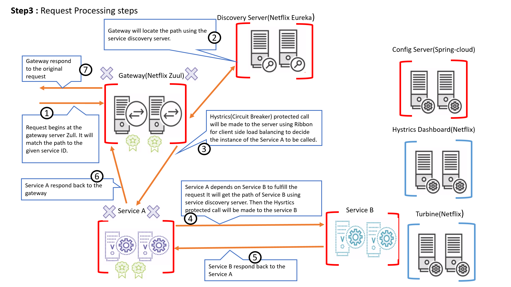
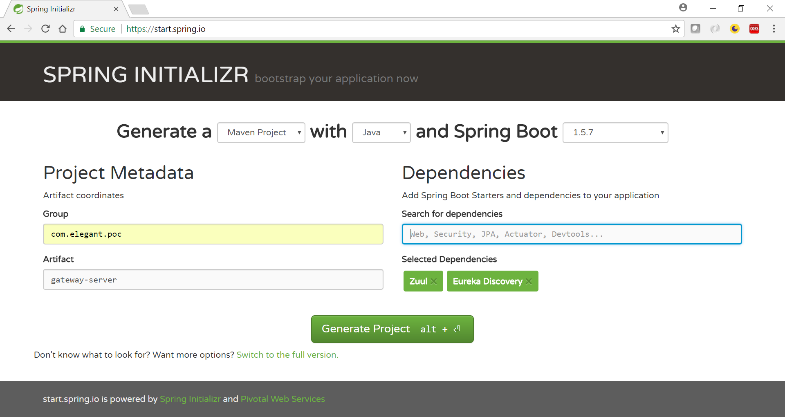

#Microservices Using Spring Cloud 

POC for micrsoservices using Spring Cloud.

Find the detailed concepts on my Blog : http://sushantgadi.in/#!/spring-cloud

##Spring cloud component interaction diagram

  

 
##Project Description
 
###The project scaffolding is done using https://start.spring.io/

##1- gateway-service :
Netflix Zuul is the front door for all requests. As an edge service application, Zuul is built to enable dynamic routing, monitoring, resiliency and security. It is the entry point where the additional logic can be applied to services such as adding a custom request header, authentication and so on.

It is generated using spring.io as shown below

  

##2- discovery-server :  
Netflix Eureka Discovery Server is a phone book for the microservices. Each service registers itself with the service registry and tells the registry where it lives (host, port, node name) and perhaps other service-specific metadata - things that other services can use to make informed decisions about it.

It is generated using spring.io as shown below

  

##3- config-server :  
Spring Cloud Config Server is a central config server where all configurable parameters of micro-services are written version controlled. The benefit of a central config server is that if we change a property for a microservice, it can reflect that on the fly without redeploying the microservice.

The configurable property are kept in git repo in the demo project.

It is generated using spring.io as shown below

  

##4- hystrix-dashboard :  
If we design our systems on microservice based architecture, we will generally develop many Microservices and those will interact with each other heavily in achieving certain business goals. Now, all of us can assume that this will give expected result if all the services are up and running and response time of each service is satisfactory. 

Now what will happen if any service, of the current Eco system, has some issue and stopped servicing the requests. It will result in timeouts/exception and the whole Eco system will get unstable due to this single point of failure. 

Here circuit breaker pattern comes handy and it redirects traffic to a fall back path once it sees any such scenario. Also it monitors the defective service closely and restore the traffic once the service came back to normalcy. So circuit breaker is a kind of a wrapper of the method which is doing the service call and it monitors the service health and once it gets some issue, the circuit breaker trips and all further calls goto the circuit breaker fall back and finally restores automatically once the service comes back. 

You can put the url of any service on the hystrix instance to generate its live dashboard.

It is generated using spring.io as shown below

  

